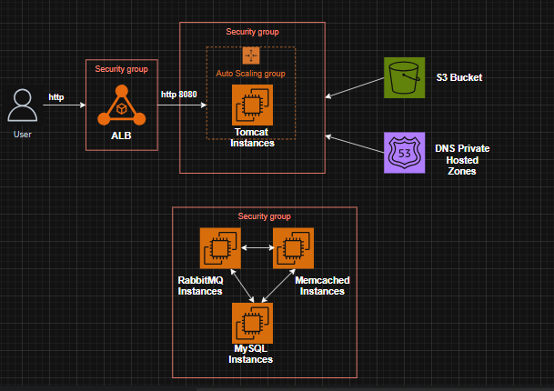

# vProfile Application: Lift & Shift Migration to AWS

## 📌 Project Overview
This project demonstrates a professional "Lift & Shift" migration of a multi-tier Java web application from an on-premises style setup to a fully functional AWS Cloud environment. 

The goal was to move the **vProfile** stack (Java, MySQL, RabbitMQ, Memcached) to AWS, ensuring high availability, security, and scalability using AWS managed services and EC2.

---

## 🏗️ Architecture
The application is deployed with a multi-tier architecture:
* **Web Tier:** Application Load Balancer (ALB) handling incoming traffic.
* **Application Tier:** Tomcat running on EC2 instances within an Auto Scaling Group.
* **Backend Tier:** * **MySQL** (Database)
    * **Memcached** (Caching)
    * **RabbitMQ** (Message Broker)
* **Storage:** Amazon S3 for storing application artifacts (WAR files).
* **Networking:** Route 53 Private Hosted Zones for internal service discovery.

---

## 🛠️ Tech Stack & Tools
* **Cloud Provider:** AWS (EC2, S3, ALB, Route 53, IAM)
* **Application:** Java Spring Boot (vProfile)
* **Build Tool:** Maven
* **Database & Middleware:** MySQL, RabbitMQ, Memcached
* **OS:** Amazon Linux 2023 / Ubuntu

---

## 🚀 Key Implementation Details

### 1. Internal Service Discovery
Instead of hardcoding private IP addresses, I implemented a **Route 53 Private Hosted Zone**. 
* The application connects to `db01.vprofile.local` instead of a static IP.
* This makes the infrastructure "self-healing"—if an instance is replaced, we only update the DNS record.

### 2. Security & Isolation
Security Groups were configured using the **Principle of Least Privilege**:
* **Backend Services:** Only allow inbound traffic from the App Tier Security Group.
* **App Tier:** Only allows inbound traffic from the Load Balancer.

### 3. Automated Deployment (User Data)
I used **Bash scripts (User Data)** to automate the installation and configuration of all services upon instance launch, ensuring a consistent and repeatable setup.

---

## 🚦 How to Access the App
Since this project uses the AWS Free Tier without a custom domain:
1.  Navigate to the **EC2 Console** > **Load Balancers**.
2.  Copy the **DNS Name** of the Application Load Balancer.
3.  Paste the DNS name into your browser to access the vProfile application.

---

## 📂 Project Structure
* `/src`: Application source code.
* `/userdata`: Bash scripts used for bootstrapping EC2 instances.
* `pom.xml`: Maven configuration for building the WAR file.

---

## 📖 Detailed Documentation
For more technical details on the infrastructure setup, please refer to:
* [Artifact Management (S3)](S3_DEPLOYMENT.md) - How the build is stored and retrieved.
* [Internal DNS (Route 53)](Route53-Records.md) - How backend services communicate.
